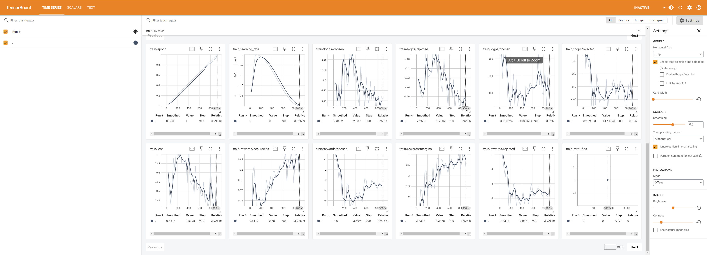

# cs234-chatbot-RLHF
cs234 final project

# Description of the project
This is the final project for CS234 called chatbot using RLHF. We introduce a method for fine-tuning large language models through Direct Preference Optimization (DPO), a reinforcement learning technique. Our experiments show that DPO streamlines the training process, enhances computational efficiency, and delivers competitive performance. Evaluation with BLEU, ROUGE, and cosine similarity metrics confirms effective learning and convergence, although additional research is required to address observed training instability.

# Running time and Equipment
It will take 13 hours on 2*A6000 with 3 epochs, or 4 hours on 1*A100 with 1 epoch

# File explanation
RLHF_DPO.ipynb: It is the main file, focusing on fine tune the chatbot with DPO method with pairwise data
bleu_rouge.ipynb: Evaluation metrics, including BLEU and ROUGE, were used to compare the output of the fine-tuned chatbot and the pretrained chatbot against the reference answers.
cosine_sin.py: evaluation metric of cosine similarity on the output from the post-trained and pretrained chatbot compared to the reference model

Please use the tensorboard file to open the events.out.tfevents.1717750823.r7501.430251(1).0 file, this file is used to record the training loss log. Here is an example og how it will look like:

# Set up the environment
For DPO training: 

#"transformers[sentencepiece]==4.38.2" \ "datasets==2.16.1" \
"accelerate==0.26.1" \"evaluate==0.4.1" \
"bitsandbytes==0.42.0" \
"trl==0.7.11" \"peft==0.8.2" \"pillow"\"flash-attn"

# Acknowledge
For the pretrained model, we use model with model ID "cognitivecomputations/dolphin-2.1-mistral-7b" extracted from huggingface.
For DPO training dataset, we use "argilla/ultrafeedback-binarized-preferences-cleaned"
For the evaluation dataset, we use "openai/webgpt_comparisons" data

